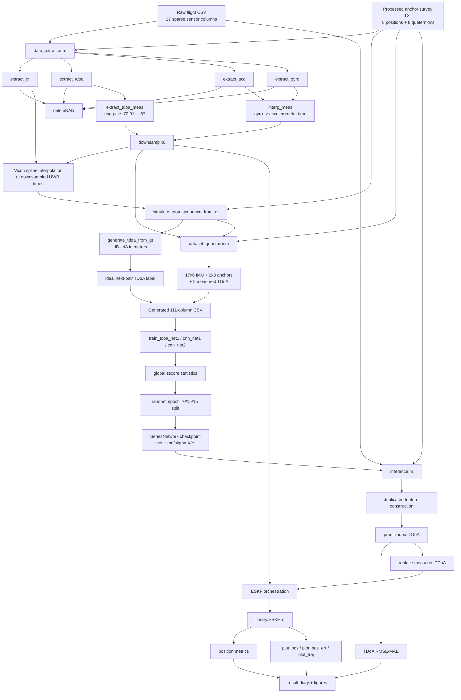
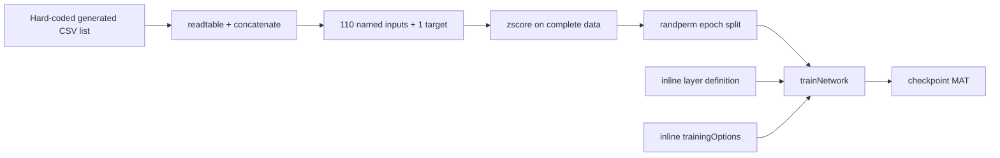
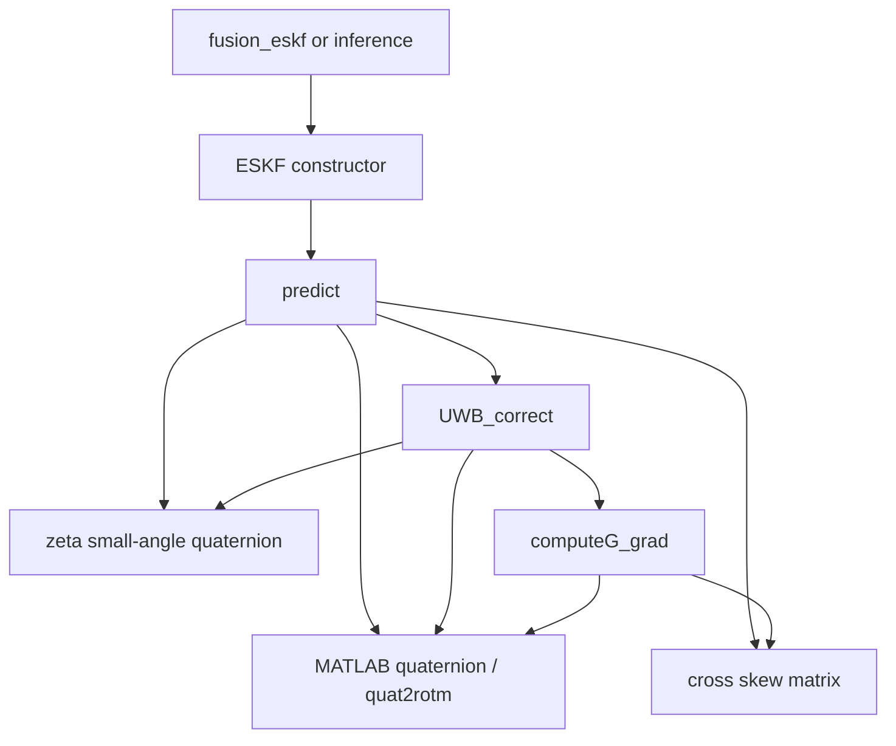
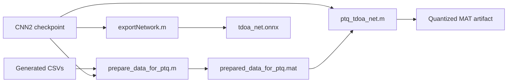

# Dependency map

## Active pipeline



This graph represents current source dependencies, not the desired architecture. In particular, feature construction is not a shared function: the `FEAT` and `IFEAT` nodes are separate copies of similar code.

## Dataset-generation call chain

```text
dataset_generator_runner.m
  -> sets csv_file / anchors / export_csv_file in base workspace
  -> data_extractor.m
       -> addpath('library')
       -> extract_gt -> deleteNAN
       -> extract_tdoa -> deleteNAN
       -> extract_acc -> deleteNAN
       -> extract_gyro -> deleteNAN
       -> interp_meas
       -> downsamp
       -> extract_tdoa_meas
       -> simulate_tdoa_sequence_from_gt
            -> generate_tdoa_from_gt
  -> dataset_generator.m
       -> isin
       -> interp1
       -> array2table / writetable
```

Both called files are scripts. Their inputs and outputs are implicit workspace variables.

## Training dependencies



There is no shared dataset list, split function, normalizer, feature schema, model factory, or checkpoint manifest. The same 110 input names are copied into every training and PTQ script.

## Inference variants

| Entry point | Model stage | Localization stage | Distinguishing dependency |
| --- | --- | --- | --- |
| `inference.m` | Single-step FNN/CNN prediction; current file hard-codes FNN | `ESKF` | Sequential `uwb_enhanced(m)` assignment |
| `inference_timesequnce.m` | Pair-wise three-step autoregressive rollout plus alpha filter | `ESKF` | Explicit `uwb_row_at_time(target_idx)` assignment |
| `inference_tdoa.m` | Single-step CNN2 prediction | `solve_tdoa_nls_3d`/`2d` | Sliding window of 12 TDoAs; no ESKF |
| legacy `inference_lstm.m` | LSTM checkpoint under `networks/` | `ESKF` | Preserved historical path; not active baseline |
| `fusion_eskf.m` | None; raw measured TDoA | `ESKF` | Raw-filter reference path |

## ESKF internal dependencies



The class stores the complete state/covariance history, so memory allocation depends on the length of the union event timeline `K`.

## Results/reporting dependencies

```text
per-flight scripts
  -> diary TXT + FIG files
  -> manual/UNKNOWN aggregation process
  -> result_overall_tdoa_rms.xlsx
  -> result_overall_tdoa_ma.xlsx
  -> result_position_rms.xlsx
  -> plot_rms_ma.m / plot_position_rms.m
  -> thesis PNG figures
```

No code was found that constructs all three Excel summaries from the per-flight logs. This missing edge is a provenance gap.

## Deployment experiment dependencies



The ONNX output and quantized model were not found in the current inventory, so these paths are experimental/unverified.

## Standalone or obsolete candidates

- `ieee.m` has no reference from the active localization code.
- `plot_anchors_3d.m` and `plot_sampling_timeline.m` are standalone visualization helpers.
- `data_extractor.m` has optional extraction helpers for ToF, flow, and barometer, but the active neural/ESKF path does not call them.
- Root archives and older checkpoints are not code dependencies until selected manually.
- `uwb_imu_pipeline_diagram.py` is documentation generation, not runtime code, and refers to deleted LSTM scripts.

These files should not be deleted until their research provenance is established.
